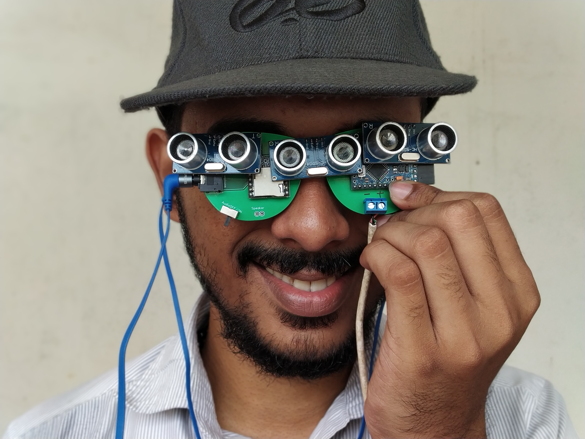
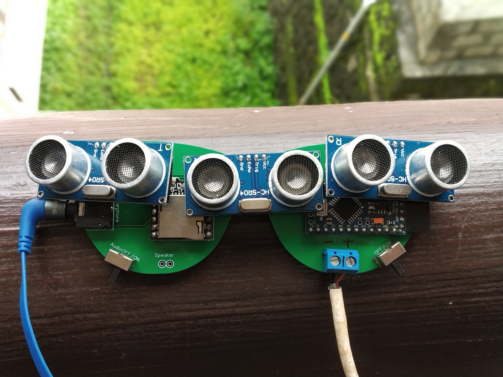
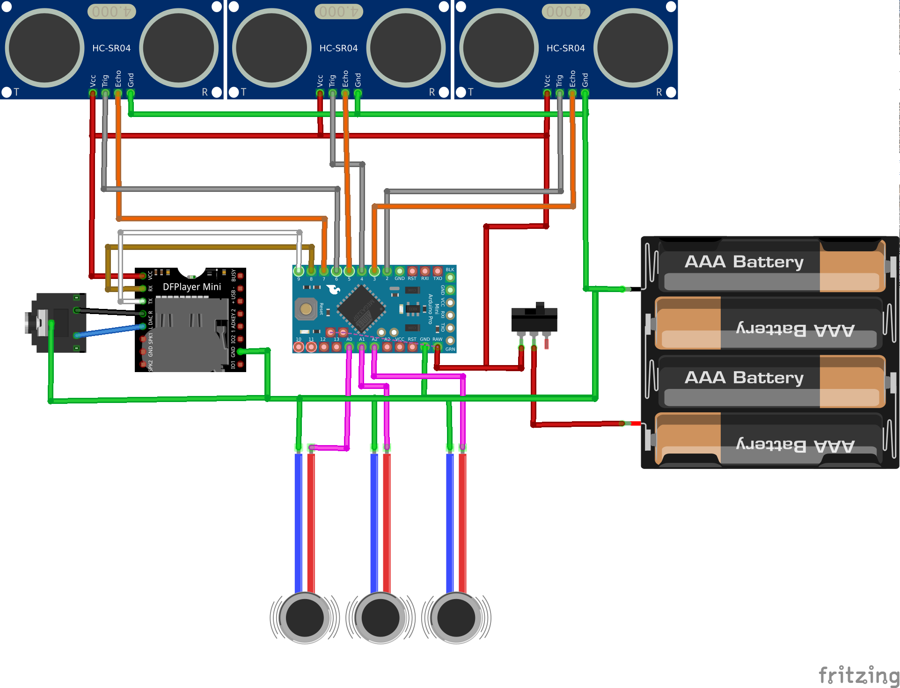

# Talking Smart Glass For Blind

There are multiple smart accessories such as smart glasses, smart watches etc available in the market. But all of them are built for us.
There is a significant lack of technology to aid the physically challenged. I wanted to build something that is useful for the visually challenged people. So i designed low cost smart glass that can be used to help the visually impaired.

This project uses few Ultrasonic distance sensors, an arduino pro mini, mp3 Player module and some vibration motors.

Circuit board used in this project is designed in the form of a spectacle, that can be worn by visually impaired person. Arduino mounted on the spectacle will detect the obstacle with the help of the sensors and notify the user through headphones and vibration motors.

## Parts needed

* 1 * Arduino pro mini 5v 16Mhz (Any version of arduino like nano or uno cane be used, but pro mini is easier to mount on the spectacles).
* 3 * HC SR04 Ultrasonic distance sensor.
* 1 * DF Player mini.
* 3 * Vibration motors.
* 3.5mm audio jack.
* 2 * Slide switches.
* 1 * SD card

### Optional

* FTDI Breakout cable (only if you are using the pro mini)
* My custom PCB  from [jlcpcb.com](https://jlcpcb.com/quote/eda?eadLink=2&uuid=c2ed7d40916740bd957b6fa516fbd572) or [pcbway.com](https://www.pcbway.com/project/shareproject/Talking_Smart_Glass_For_Blind.html)
* 3W Speaker

## The Circuit Diagram

